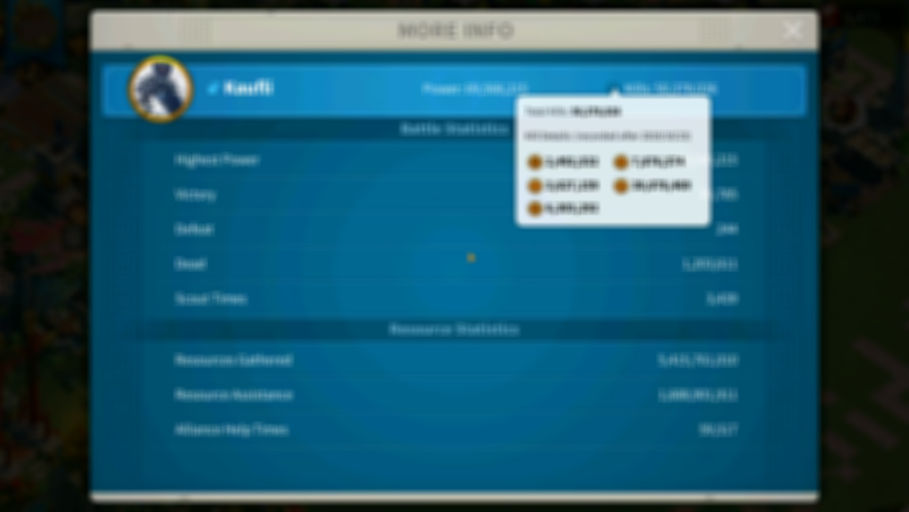

# Rise of Kingdoms CLI Tools


Command line tools to construct player statistics from [Rise of Kingdoms](https://rok.lilithgames.com/en). By analyzing recorded game play we can extract various data points such as governor power, deaths, kills and more. This can help with various kingdom statistics for fairly distributing [KvK](https://rok.guide/the-lost-kingdom-kvk/) rewards.

## Requirements

- php 7.4 *(tested)*
- Tesseract
- FFmpeg

Recommended game resolution and capture of at least 1920x1080.

## Example

As an example we'll use the Governor More Info screen as our data source.



This will give us the following:

- Name
- Power
- Total kills
- Deaths
- Kills (per troop type)

### How to

1. Record the governor(s) **More Info** screen located in their profile. Kills per troop type can also be captured by pressing **(?)** by total kills.
2. Copy video to `ROK_PATH_INPUT` as defined in `config.php`.
3. Run job:

    ```bash
    php rok.php --job=governor_more_info
    ```

4. Check `ROK_PATH_OUTPUT` for files containing Governor statistics.
