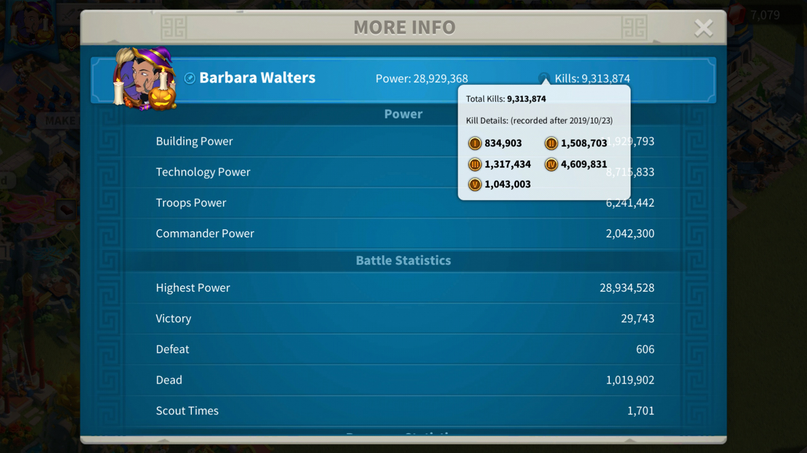

# Rise of Kingdoms CLI Tools

[](https://opensource.org/licenses/MIT)

- [How it works](#how-it-works)
- [Setup](#setup)
  - [Install](#install)
  - [Config](#config)
- [Usage](#usage)
  - [Arguments](#arguments)
- [Jobs](#jobs)
  - [Governor More Info Kills](#governor-more-info-kills)
    - [Input](#input)
    - [Data](#data)
    - [Output](#output)
- [Job definition](#job-definition)

Command line tools to help automate collection of player statistics from [Rise of Kingdoms](https://rok.lilithgames.com/en). By analyzing recorded game play we can extract various data points such as governor power, deaths, kills and more. This can help with various kingdom statistics or fairly distributing [KvK](https://rok.guide/the-lost-kingdom-kvk/) rewards.


## How it works

Here's a quick overview of what happens during application execution for job `governor_more_info_kills`.

1. Screenshots are captured from any source video representing the most "interesting" frames.
2. We iterate through each frame and perform the following actions:
   1. Screenshots are compared to sample images.
   2. The image is cropped per instructions declared in the profile. Each segment represents a single data point we're trying to collect. This is an output confirming a match was found and we're trying to capture data.

    ```
    [2020-10-08 12-37-37.mkv-329.png] #256
    Distortion: 0.0311905
    Match: governor_more_info_kills
    OCR: name 6d2cafb1c404b08e338113283ea6caad.png
    OCR: power 8a648e370f0443741fd901bfa5eac07f.png
    OCR: kills 51ea300ae469bc8ab409b39fdcafcc42.png
    OCR: deaths 372e50c3b1d58d71975d0caa93683119.png
    OCR: t1 1c23a20b131247c6c7dc67a5f1c6d6d6.png
    OCR: t2 5e456bf5f30abc09cb061288b6f0dda7.png
    OCR: t3 5de0b3e8c32f20864a41a82cb4d79004.png
    OCR: t4 5194d9efb63fa0d0b977566024314b96.png
    OCR: t5 094345220a180a383086e358f006af72.png
    ```

    A callback function can be provided to further process this data point.
3. After all reading is complete data is structured and further processed as a whole per the profile and prepared for output.
4. A table prints with the data formatted per the previously loaded profile.

## Setup

- Game resolution and capture of at least 1920x1080
- 

### Install

Requirements:

- php 7.4 *(tested)*
- [Composer](https://getcomposer.org/)
- [ImageMagick](https://imagemagick.org/)
- [Tesseract](https://github.com/tesseract-ocr/tesseract)
- [FFmpeg](https://ffmpeg.org/)

**Ubuntu**

```bash
sudo apt install imagemagick ffmpeg tesseract-ocr tesseract-ocr-all
```

```bash
git clone https://github.com/carmelosantana/rok-monster-cli
cd rok-monster-cli
composer install
```

### Config

Default jobs and basic settings are defined in `config.php`. This file should **not** be modified as it may change with development.

Changes can be made in a new file with the name of `config.local.php`. Existing jobs can be changed, new jobs can be added, and media paths can be defined in `config.local.php`. *Technically* it will load anything but for now we'll be using it for custom jobs 😅.

## Usage

1. Record the necessary screens specified per the given job. In this example we need the **Governor More Info** profile screen.
2. Copy video to `ROK_PATH_INPUT` or use `--input_path=YOUR_PATH_HERE`.
3. Run job:

    ```bash
    php rok.php --job=governor_more_info_kills --input_path=YOUR_PATH_HERE
    ```

4. Check `ROK_PATH_OUTPUT` or `--output_path` for files containing Governor statistics.

### Arguments

| Argument | Value | Default |Description |
| --- | --- | --- | --- |
| debug | `boolean` | *0* | Prints raw OCR reading per image |
| distortion | `float` | *0.037* | Distortion metric measured by Imagick compare  |
| input_path | `string` | `ROK_PATH_INPUT` | Source media files  |
| oem | `int` | *0* | OCR Engine Mode |
| output_path | `string` | `ROK_PATH_OUTPUT` | Output from rok.php  |
| psm | `int` | *7* | Page Segmentation Method |
| tessdata | `string` | `null` | User defined location for tessdata |
| tmp_path | `string` | `ROK_PATH_TMP` | Temp directory for images manipulated during processing  |
| video | `boolean` | *1* | Process video - create screenshots etc |

- *boolean 0/1*

## Jobs

Default jobs are defined in `config.php` while user defined jobs can be added to `config.local.php`. A job contains all necessary instructions to prepare an image or video for OCR.

**Available jobs:**

- [Governor More Info Kills](#governor-more-info-kills)

### Governor More Info Kills

`governor_more_info_kills`



#### Input

Recording of the governor(s) **More Info** screen located in their profile. Kills per troop type can also be captured by pressing **(?)** by total kills.

#### Data

- Name
- Power
- Total kills
- Deaths
- Kills (per troop type)

#### Output

- Table via CLI

## Job definition

Here we define parameters for each job. These parameters are user customizable and provide exact crop points for segmenting text within a screenshot and defining how Tesseract should interact with this cropped image. Each newly cropped image segment represents a single data point we want to capture.

```php
'governor_more_info_kills' => [
    'oem' => 0,
    'psm' => 7,
    'ocr_schema' => [
        'name' => [
            'crop' => [472, 147, 407, 91],
        ],
        'power' => [
            'whitelist' => range(0, 9),
            'crop' => [980, 168, 216, 35],
            'callback' => 'text_remove_non_numeric',
        ],
    ],
];
```

This sample config would output the following data.

| name | power |
| --- | --- |
| Barbara Walters | 25,351,714 |
| Zal zal | 28,512,574 |

Now we breakdown the config and explain each part.

| Key | Explanation |
| --- | --- |
| `governor_more_info_kills` | Array key is job title |
| `oem` | Specify the OCR Engine Mode [Tesseract](https://github.com/tesseract-ocr/tessdoc/blob/master/Command-Line-Usage.md) |
| `psm` | Specify the Page Segmentation Method [Tesseract](https://github.com/tesseract-ocr/tessdoc/blob/master/Command-Line-Usage.md) |
| `ocr_schema` | Start defining each data point |
| `name` | Data point with ID of `name` |
| `crop` | Crop points to segment `name` from the image. [x, y, image-crop-x, image-crop-y] |
| `power` | Data point with ID of `power` |
| `whitelist` | Character whitelist [tesseract-ocr-for-php](https://github.com/thiagoalessio/tesseract-ocr-for-php#whitelist) |
| `crop` | Crop points to segment `power` from the image. [x, y, image-crop-x, image-crop-y] |
| `callback` | The callback function receives raw OCR data as it's only argument to further processing. This could be for any cleanup or additional data manipulation before next image is processed.  |
