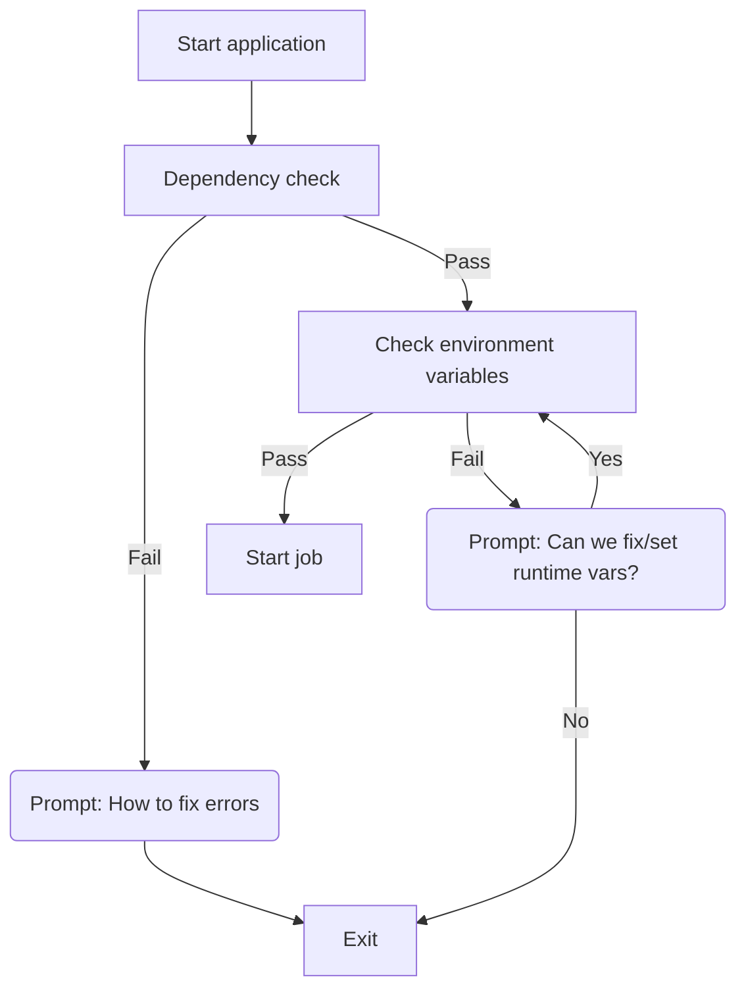

# Processes

> *Future flows.*

## Installer

## Launch

```mermaid
graph TB
    A[Start application]-->B[Dependency check]
    B-- Fail -->C(Prompt: How to fix errors)-->Z
    B-- Pass -->D[Check environment variables]
    D-- Fail -->E(Prompt: Can we fix/set runtime vars?)
    E-- Yes -->D
    E-- No ---->Z[Exit]
    D-- Pass -->F[Start job]
```

## Image Scanning

### Job Identification

### Template Building
